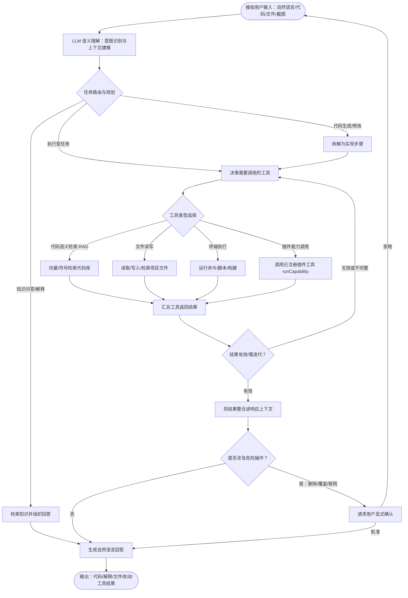

# BubaiCode AI Agent 工作流程图

下图展示 Agent 从接收输入、分析处理、调用工具到输出结果的工作流程与决策节点。

```mermaid
flowchart TD
    Input([接收用户输入：自然语言/代码/文件/截图]) --> Understand[LLM 语义理解：意图识别与上下文建模]
    Understand --> Route{任务路由与规划}

    Route -->|代码生成/修改| Decomp[拆解为实现步骤]
    Route -->|知识问答/解释| Retrieve[检索知识并组织回答]
    Route -->|执行型任务| ToolDecide[决策需要调用的工具]

    Decomp --> ToolDecide
    Retrieve --> OutGen[生成自然语言回答]
    ToolDecide --> Select{工具类型选择}

    Select -->|代码语义检索 RAG| RAG[向量/符号检索代码库]
    Select -->|文件读写| FileIO[读取/写入/检索项目文件]
    Select -->|终端执行| Exec[运行命令/脚本/构建]
    Select -->|插件能力调用| Plugin[调用已注册插件工具 runCapability]

    RAG --> Collect[汇总工具返回结果]
    FileIO --> Collect
    Exec --> Collect
    Plugin --> Collect

    Collect --> Valid{结果有效/需迭代？}
    Valid -->|无效或不完整| ToolDecide
    Valid -->|有效| Integrate[将结果整合进响应上下文]
    Integrate --> Safe{是否涉及危险操作？}
    Safe -->|是：删除/覆盖/联网| Ask[请求用户显式确认]
    Safe -->|否| OutGen
    Ask -->|批准| OutGen
    Ask -->|拒绝| Input
    OutGen --> Done([输出：代码/解释/文件改动/工具结果])
```
