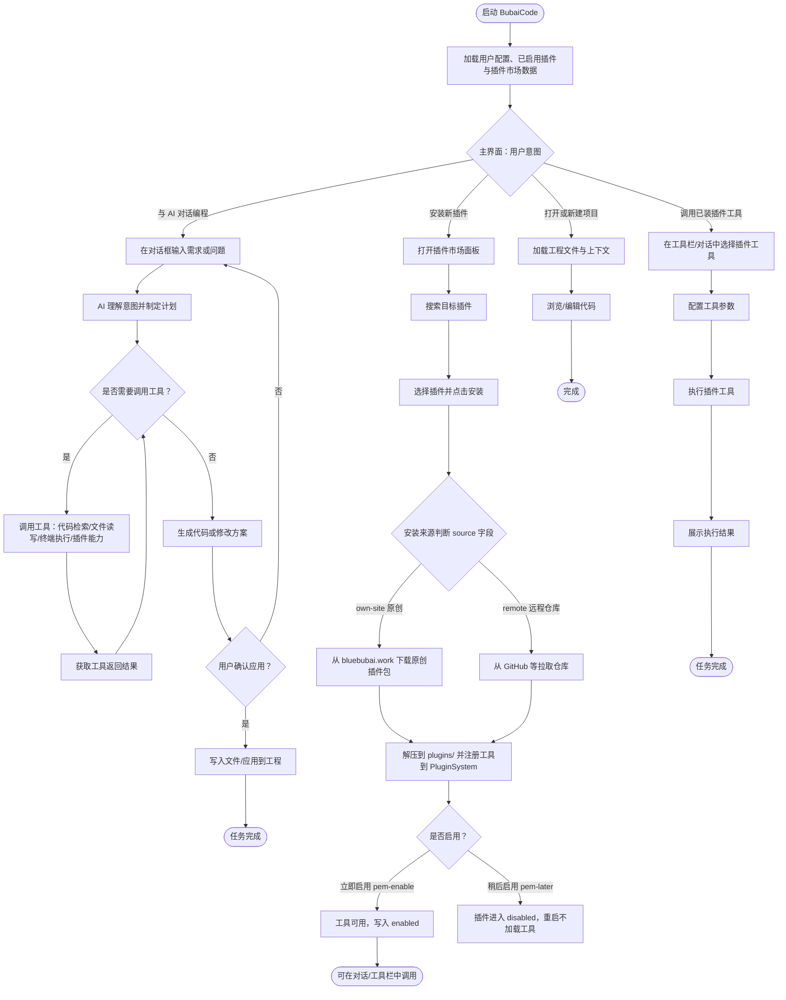

# BubaiCode 软件使用流程图

下图展示用户从启动 BubaiCode 到完成主要任务的完整操作步骤与分支逻辑。

```mermaid
flowchart TD
    Start([启动 BubaiCode]) --> Load[加载用户配置、已启用插件与插件市场数据]
    Load --> Home{主界面：用户意图}

    Home -->|与 AI 对话编程| Chat[在对话框输入需求或问题]
    Home -->|安装新插件| Market[打开插件市场面板]
    Home -->|调用已装插件工具| Tool[在工具栏/对话中选择插件工具]
    Home -->|打开或新建项目| Proj[加载工程文件与上下文]

    Chat --> Analyze[AI 理解意图并制定计划]
    Analyze --> NeedTool{是否需要调用工具？}
    NeedTool -->|是| Call[调用工具：代码检索/文件读写/终端执行/插件能力]
    Call --> Res[获取工具返回结果]
    Res --> NeedTool
    NeedTool -->|否| Gen[生成代码或修改方案]
    Gen --> Confirm{用户确认应用？}
    Confirm -->|是| Apply[写入文件/应用到工程]
    Confirm -->|否| Chat
    Apply --> Done1([任务完成])

    Market --> Search[搜索目标插件]
    Search --> Pick[选择插件并点击安装]
    Pick --> Src{安装来源判断 source 字段}
    Src -->|own-site 原创| Down[从 bluebubai.work 下载原创插件包]
    Src -->|remote 远程仓库| Git[从 GitHub 等拉取仓库]
    Down --> Unzip[解压到 plugins/ 并注册工具到 PluginSystem]
    Git --> Unzip
    Unzip --> Enable{是否启用？}
    Enable -->|立即启用 pem-enable| Ready[工具可用，写入 enabled]
    Enable -->|稍后启用 pem-later| Disabled[插件进入 disabled，重启不加载工具]
    Ready --> Done2([可在对话/工具栏中调用])

    Tool --> Cfg[配置工具参数]
    Cfg --> Exec[执行插件工具]
    Exec --> Out[展示执行结果]
    Out --> Done3([任务完成])

    Proj --> Edit[浏览/编辑代码]
    Edit --> Done4([完成])
```
